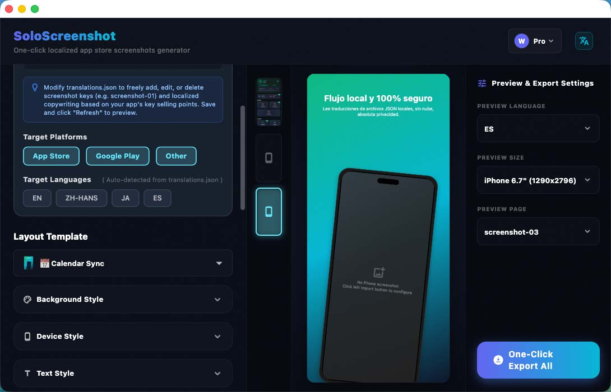

# SoloScreenshot

[English](README.md) | [简体中文](README.zh-CN.md)

---

SoloScreenshot is a **local app store screenshot generator and mockup studio** for macOS and Windows.

It helps indie developers and global app teams design product screenshots, reuse localized copy from local translation JSON files, and export store-ready image folders without uploading unreleased UI to a cloud tool.

SoloScreenshot is free to try. Lifetime Pro unlocks batch export for all screens, store sizes, and configured languages.

**Official Website:** [https://screenshot.solodept.com/](https://screenshot.solodept.com/)

---

## Why SoloScreenshot

*   **Local-first workflow:** Screenshots, mockups, and translation files stay on your computer.
*   **Localized screenshot production:** Load translation JSON once, then preview and export screenshots for multiple languages.
*   **Store-ready exports:** Generate folders for App Store, Google Play, Fastlane, and custom sizes in a predictable structure.
*   **Reusable projects:** Save layout, device, background, and text settings so UI or copy updates can be re-exported quickly.
*   **Practical templates:** Start from device frames, backgrounds, typography settings, and screenshot layouts designed for product pages.

---

## Download

Download the latest production builds from [GitHub Releases](https://github.com/solodept/soloscreenshot/releases).

| OS | Download Link | Notes |
| :--- | :--- | :--- |
| **macOS** | [Download macOS DMG](https://github.com/solodept/soloscreenshot/releases) | Signed and notarized DMG package |
| **Windows** | [Download Windows ZIP](https://github.com/solodept/soloscreenshot/releases) | ZIP package, unzip and run the app |

---

## Typical Web Tools vs SoloScreenshot

| Workflow | Typical Web Tools | SoloScreenshot |
| :--- | :--- | :--- |
| **Privacy** | Upload draft screens to a remote service | Render and export on your own computer |
| **Localization** | Copy text into each design manually | Load local translation JSON and batch export locales |
| **Delivery** | Download scattered images one by one | Generate structured folders for store submission |

---

## Pricing

| Tier | Price | Included Features |
| :--- | :--- | :--- |
| **Free** | **$0** | Design, preview, and export one screenshot at a time. |
| **Lifetime Pro** | **$4.99** Early Bird | Batch export all screens, sizes, and configured languages. One-time payment, no subscription. |

---

## macOS First Launch

The macOS build is code-signed and notarized by Apple. In most cases, you can install and open SoloScreenshot directly after downloading the DMG from the official website or GitHub Releases.

If macOS still asks for confirmation because the app was downloaded outside the Mac App Store:

1. Make sure you downloaded the latest DMG from [GitHub Releases](https://github.com/solodept/soloscreenshot/releases).
2. Drag `SoloScreenshot.app` into the `Applications` folder.
3. Open **System Settings > Privacy & Security**, find the SoloScreenshot notice, and click **Open Anyway** if needed.
