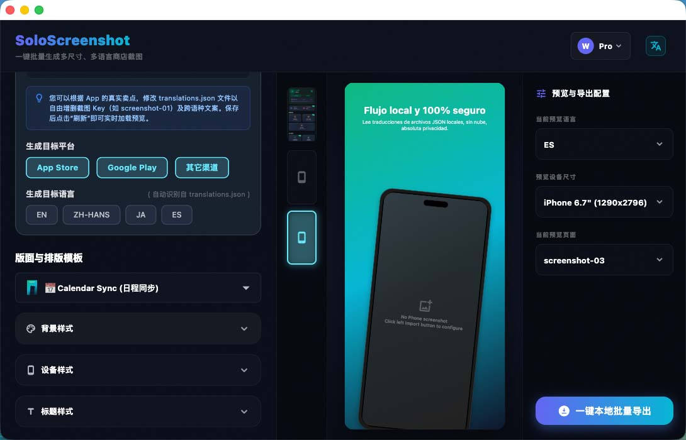

# SoloScreenshot

[English](README.md) | [简体中文](README.zh-CN.md)

---

[](#)
[](https://flutter.dev)
[](#)

SoloScreenshot 是一款面向 macOS 和 Windows 的 **本地 App 商店截图生成器与样机排版工具**。

它适合独立开发者和出海应用团队使用：在本地设计产品截图，读取本地多语言 JSON 文案，并导出符合应用商店规格的图片目录，无需把未发布 UI 上传到第三方在线工具。

**官方网站:** [https://screenshot.solodept.com/](https://screenshot.solodept.com/)



---

## 为什么使用 SoloScreenshot

*   **本地优先工作流**：截图、样机和翻译文件都保留在自己的电脑上。
*   **多语言截图生产**：加载一次翻译 JSON，即可预览并导出多个语言版本的商店截图。
*   **商店规格导出**：按 App Store、Google Play、Fastlane 和自定义尺寸生成清晰的导出目录。
*   **可复用项目**：保存布局、设备、背景和文字样式配置，后续 UI 或文案更新时可以快速重新导出。
*   **实用排版模板**：内置设备外壳、背景、字体和截图布局，帮助产品页截图更快成型。

---

## 下载

可以在 [GitHub Releases](https://github.com/solodept/soloscreenshot/releases) 下载最新生产版本。

| 操作系统 | 下载链接 | 说明 |
| :--- | :--- | :--- |
| **macOS** | [下载 macOS DMG](https://github.com/solodept/soloscreenshot/releases) | DMG 安装包，首次打开说明见下方 |
| **Windows** | [下载 Windows ZIP](https://github.com/solodept/soloscreenshot/releases) | ZIP 压缩包，解压后运行应用 |

---

## 传统网页版工具 vs SoloScreenshot

| 工作流 | 传统网页版工具 | SoloScreenshot |
| :--- | :--- | :--- |
| **隐私安全** | 需要把草稿截图上传到远程服务 | 在自己的电脑上完成渲染与导出 |
| **多语言本地化** | 每个页面都要手动复制粘贴文案 | 加载本地翻译 JSON 后批量导出多语言截图 |
| **打包交付** | 逐张下载零散图片 | 自动生成适合商店提交的目录结构 |

---

## 价格方案

| 版本 | 价格 | 包含权益 |
| :--- | :--- | :--- |
| **免费版** | **$0** | 设计、预览并导出单张截图。 |
| **终身 Pro 版** | **$4.99** 早鸟价 | 批量导出所有页面、尺寸和已配置语言。一次性付款，无订阅。 |

---

## macOS 首次打开

SoloScreenshot 目前通过 Mac App Store 之外的方式分发。首次打开时，macOS Gatekeeper 可能提示 **“无法验证开发者，无法打开”** 或 **“应用已损坏”**。

可以尝试以下方式：

1. 打开 **系统设置 > 隐私与安全性**，找到 SoloScreenshot 的安全提示，点击 **仍要打开**。
2. 如果 macOS 仍然阻止打开，请先将 `SoloScreenshot.app` 拖入 `应用程序 (Applications)` 文件夹，打开 **终端 (Terminal)**，然后执行：

   ```bash
   xattr -cr /Applications/SoloScreenshot.app
   ```
